# Цель работы

Изучить основы кибербезопасности

# Криптография на практике

## ВВедение в криптографию

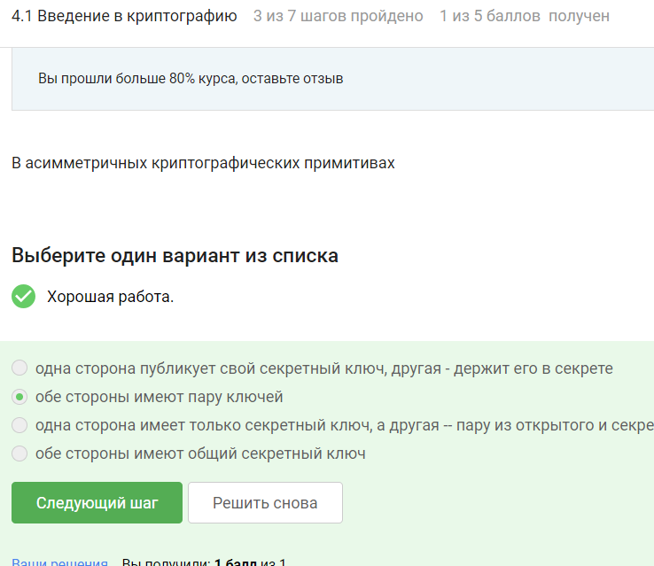

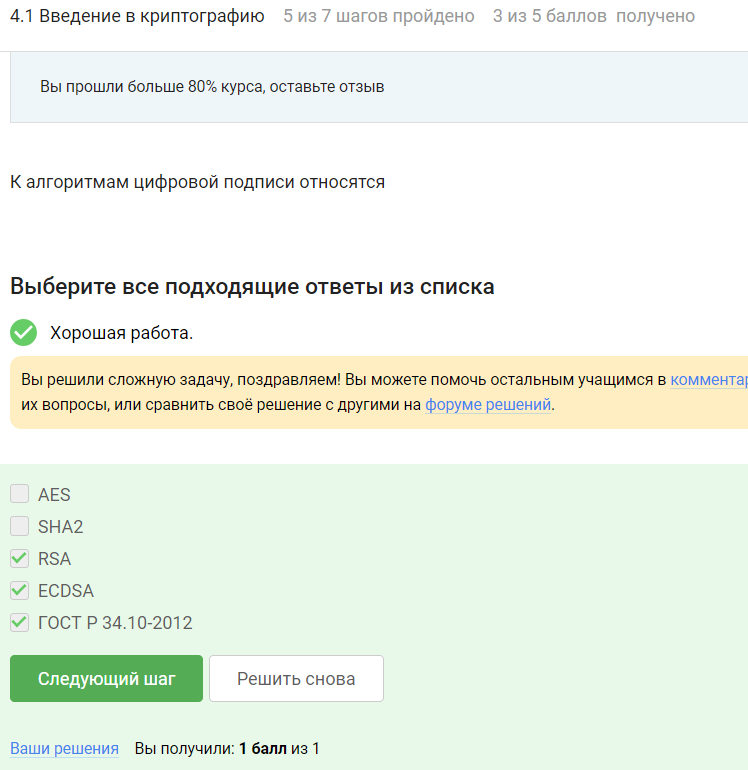

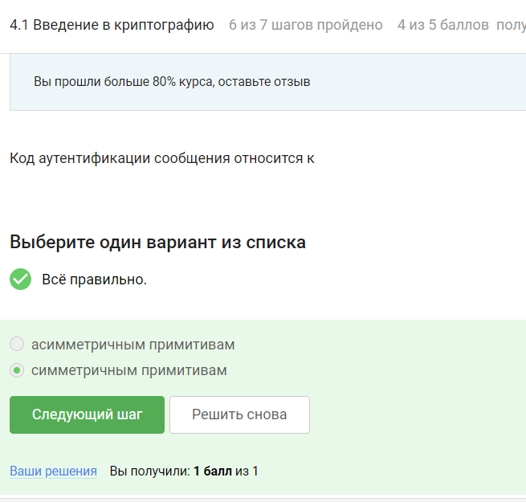

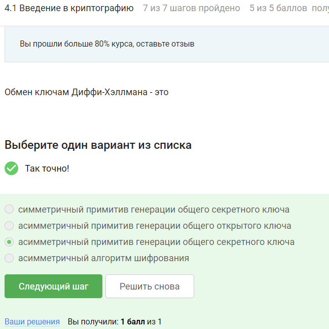

## Цифровая подпись 

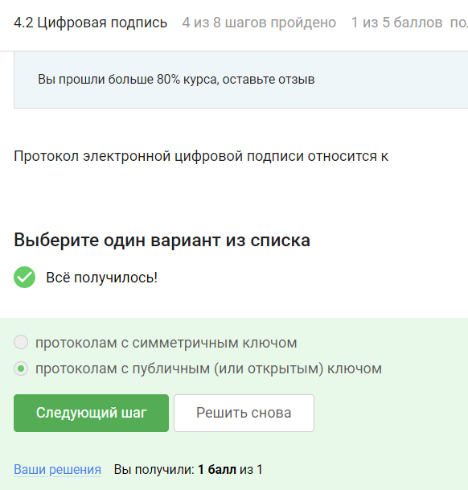

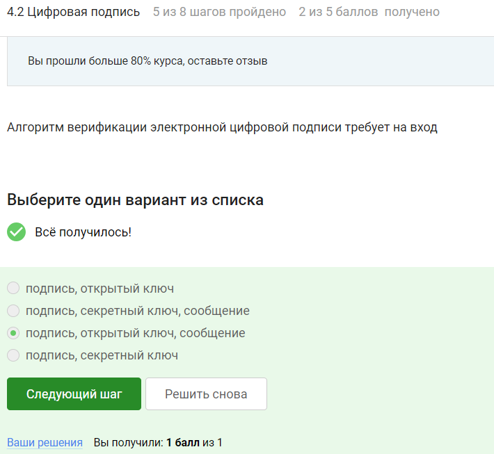

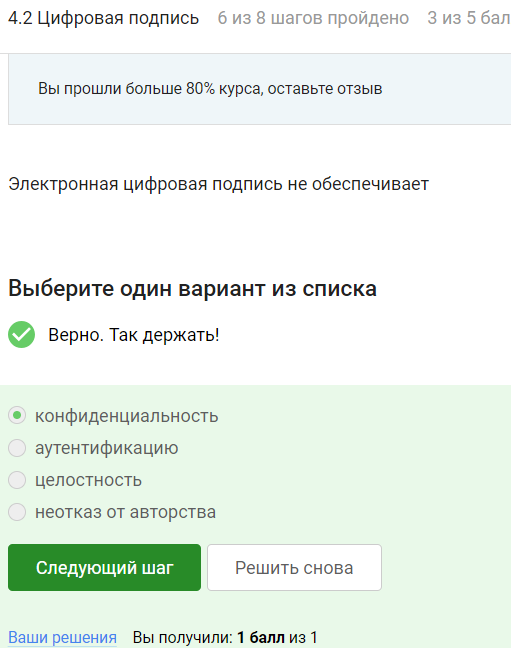

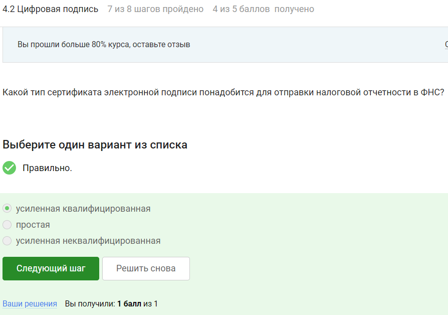

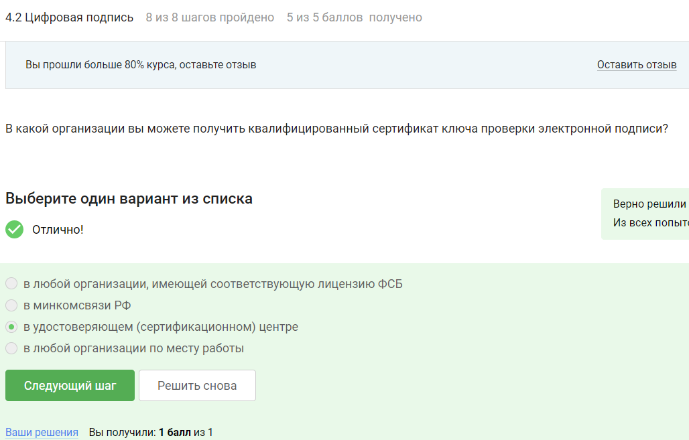

## Электронные платежи

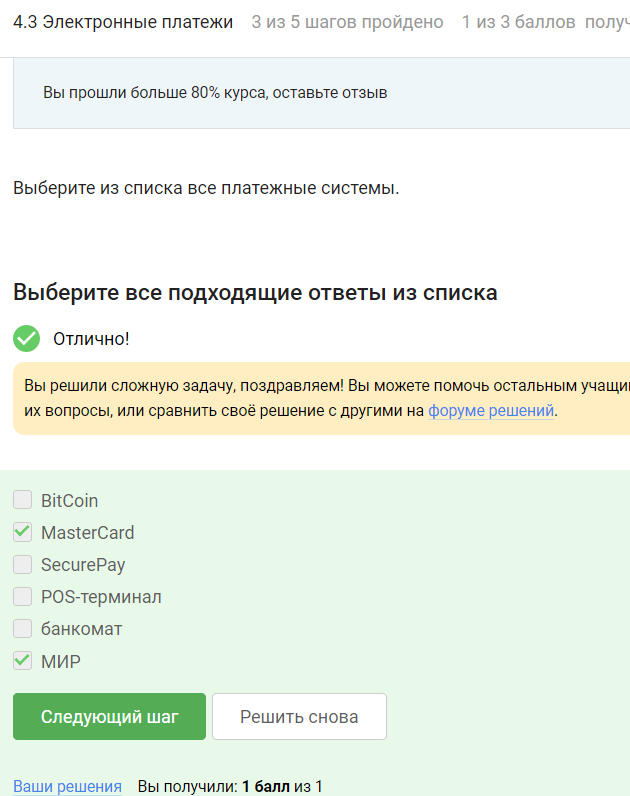

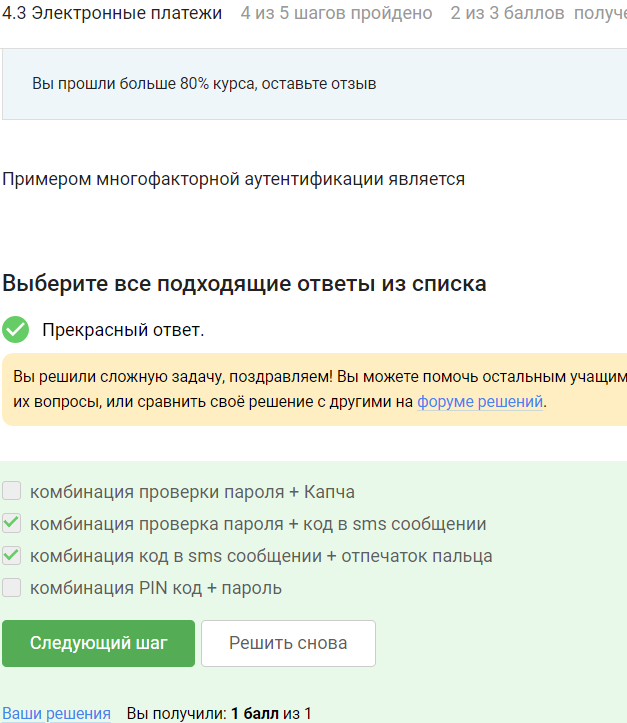

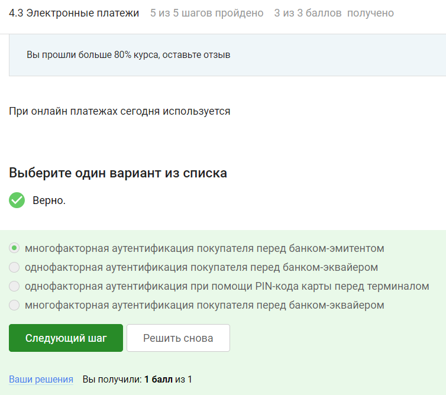

## Блокчейн

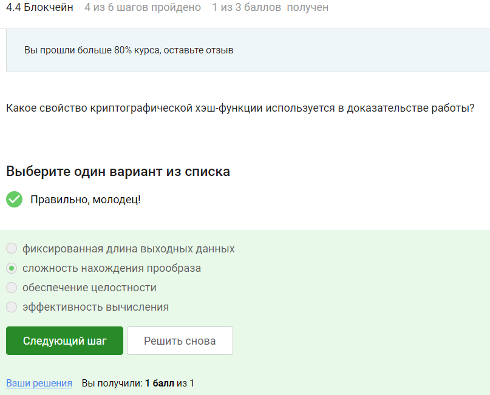

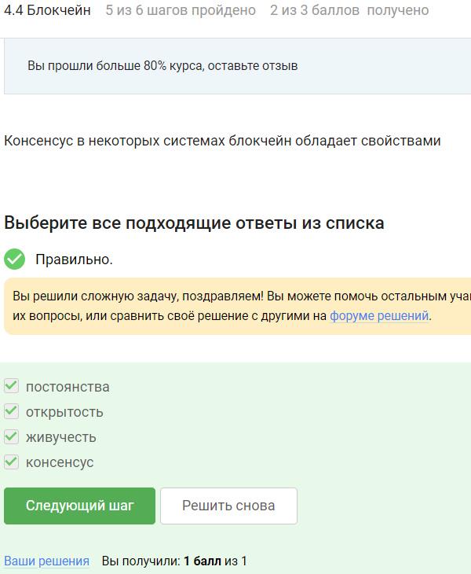

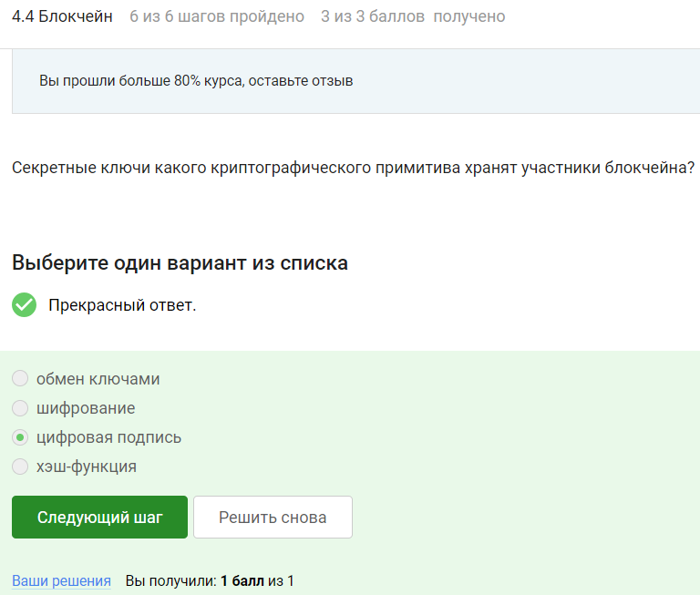

# Выводы

Сертификат не выдается.

