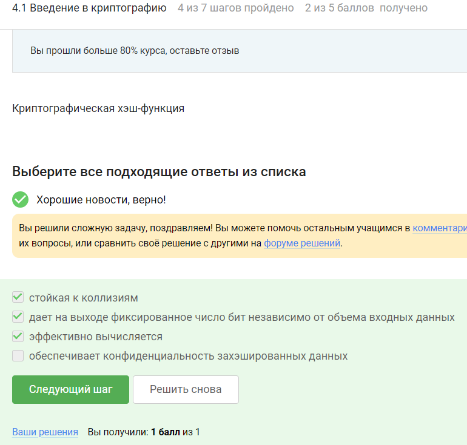

# Цель работы

Изучить основы кибербезопасности

# Криптография на практике

## ВВедение в криптографию

## Цифровая подпись 

## Электронные платежи

## Блокчейн

# Выводы

Сертификат не выдается.

