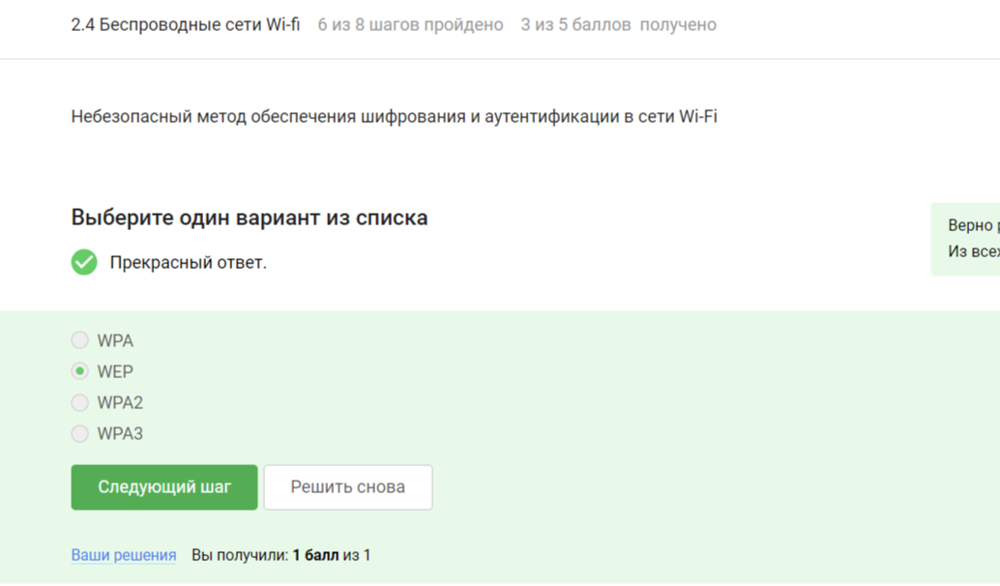

# Цель работы

Изучить основы кибербезопасности

# Выполнение лабораторной работы

## Прохождение курса
1. Введение в курс

# Безопасность в сети 

## 2.1 Как работает интернет: базовые сетевые протоколы

## Персонализация сети.

## Браузер TOR. Анимация.

## Беспроводные сети. Wi-Fi

# Выводы

Мы узнали о правилах безопасности в сети.

Сертификат не выдается.

:::
