# Цель работы

Изучить основы кибербезопасности

# Защита ПК/телефона

## Шифрование диска

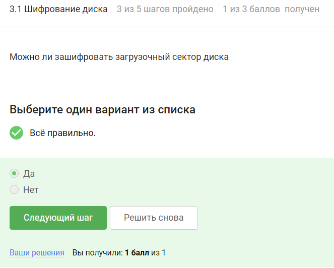

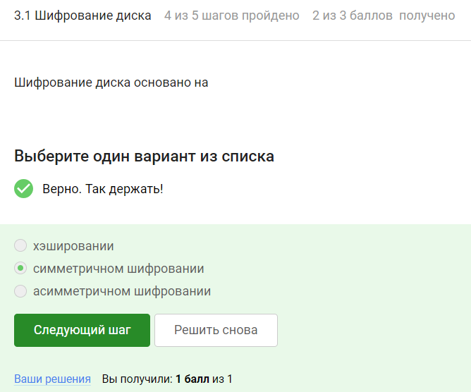

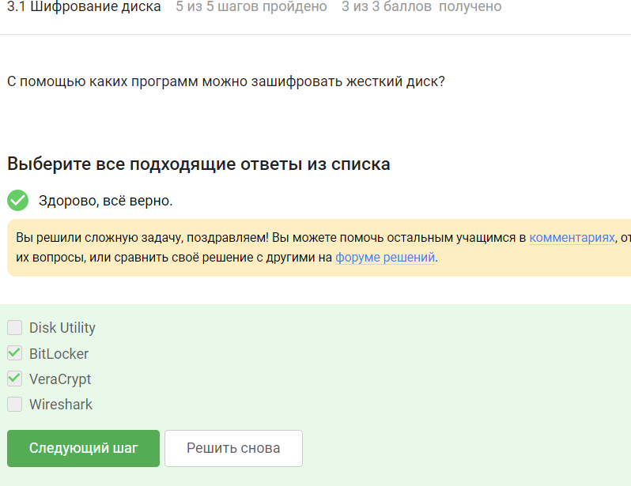

## Пароли

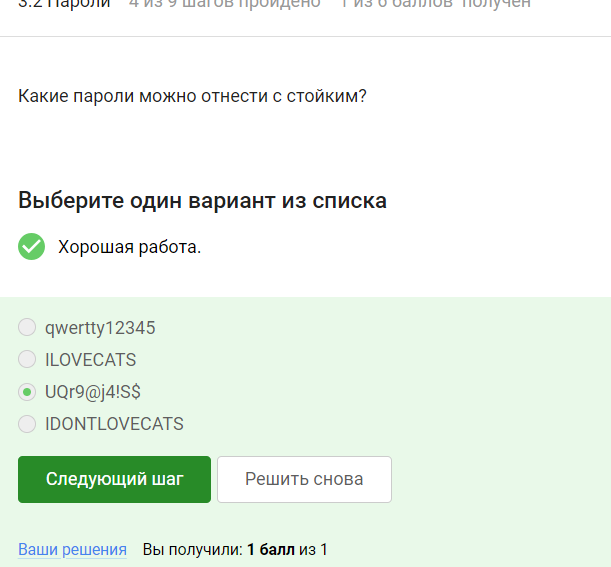

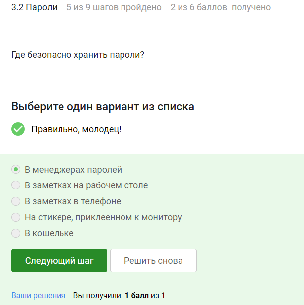

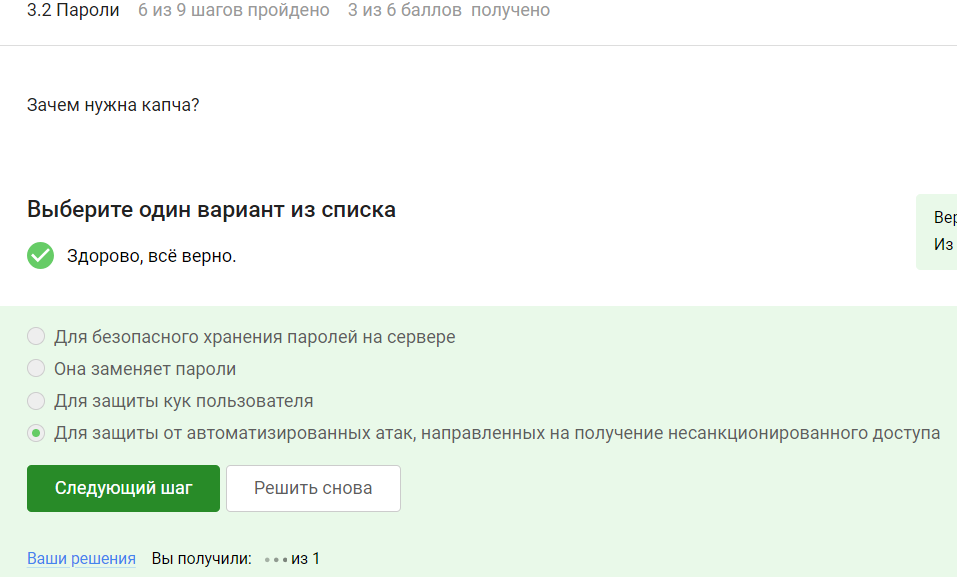

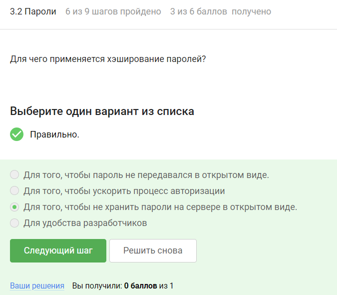

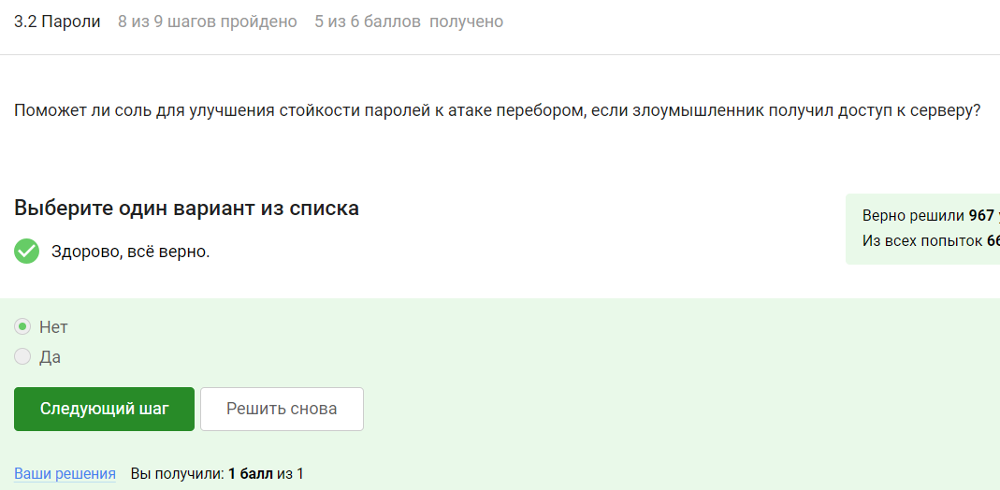

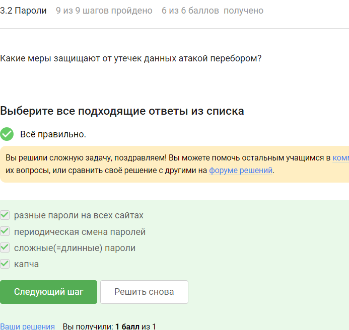

## Фишинг

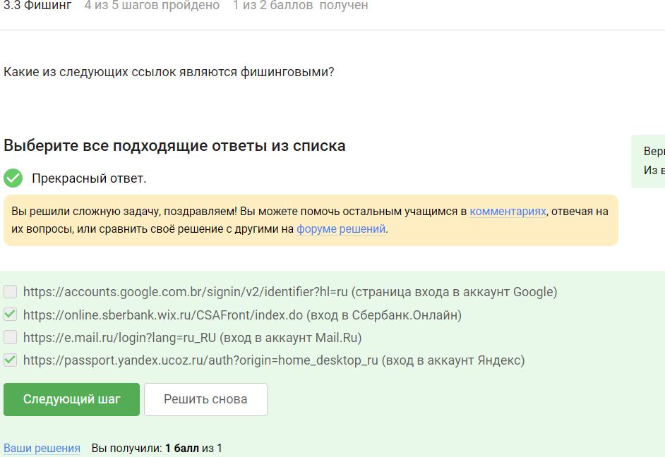

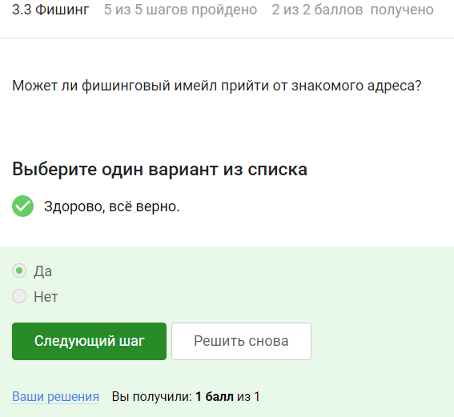

## Вирусы.Примеры

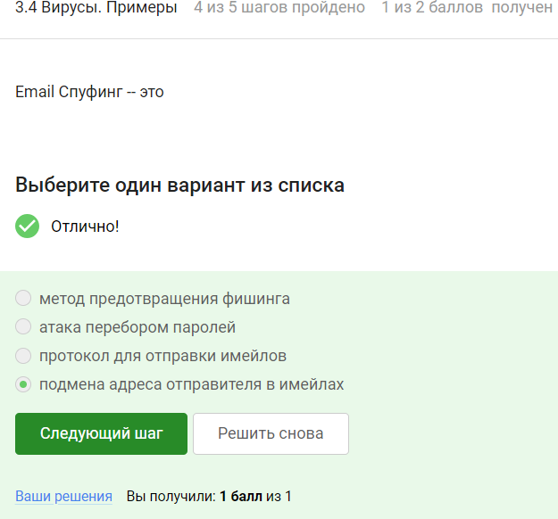

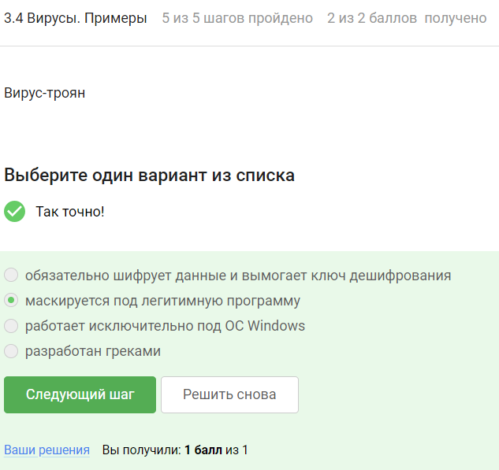

## Безопасность мессенджеров

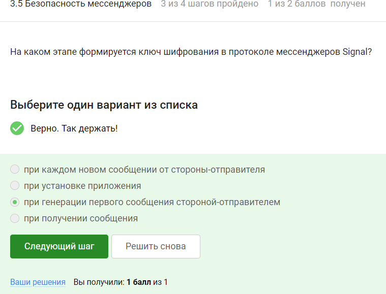

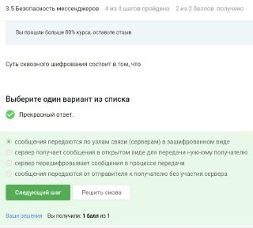

# Выводы

Мы узнали о защите ПК/телефона.

Сертификат не выдается.

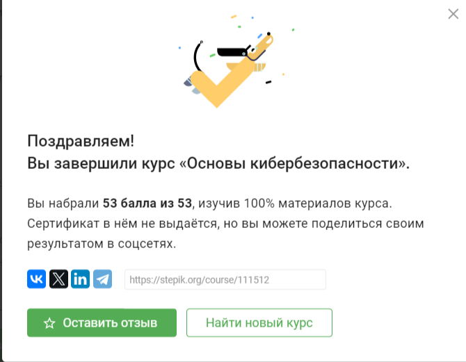
